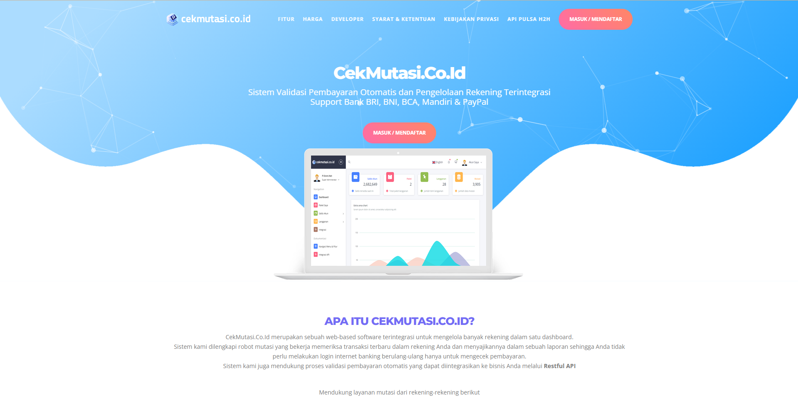

# Cek Mutasi

Disclaimer: Sebelum melakukan setting pembayaran, di sarankan untuk setting terlebih dahulu produk, asset-asset web anda, whatsapp service (notifikasi pesanan otomatis)\
\
Langkah-langkah yang harus di lakukan untuk setting cek mutasi:

1. Pastikan memiliki akun rekening yang sudah terdaftar internet banking (Bank BCA, Bank Mandiri, Bank BNI, Bank BRI)
2.  Silahkan daftar akun cek mutasi anda melalui [tautan berikut ini](https://cekmutasi.co.id/app/register)\

    <figure><figcaption></figcaption></figure>
3. Setelah daftar lalu silahkan kembali ke menu dashboard panel > payment > cek mutasi > manage

<figure><figcaption></figcaption></figure>

4\. Lalu edit >

<figure><figcaption>
Keterangan: a. Menu untuk merubah icon pembayaran b. Menu untuk memasukan atas nama pemilik rekening c. Menu untuk memasukan nomor rekening d. Menu untuk memasukan username internet banking e. Menu untuk memasukan password internet banking f. Menu untuk setup minimal transaksi menggunakan metode bank transfer/cek mutasi g. Pilih paket layanan cek mutasi (pilihan sesuai banyaknya transaksi, pilih enterprise pada umumnya)
</figcaption></figure>

<figure><figcaption>
Keterangan: h. Menu untuk memasukan deskripsi pembayaran (custom) i. Menu untuk menentukan status pembayaran dengan merchant (switch on/off) j. Menu untuk menentukan status pembayaran pada website Anda (switch on/off) k. Menu untuk menyimpan semua perubahan
</figcaption></figure>

Catatan custom description payment cek mutasi:

**Mobile Banking BCA (BCA Mobile)**

* Log in pada aplikasi BCA Mobile Anda
* Pilih m-Transfer pada halaman utama
* Pilih Daftar Transfer Antar Rekening
* Masukan nomor rekening **81XXXXXX** / a/n **NAMA REKENING ANDA** lalu pilih Send dan nomor rekening akan terdaftar
* Pilih Transfer Antar Rekening
* Pilih Ke Rekening dan pilih Rekening tertuju yang baru terdaftar
* Masukan Jumlah Uang dan mohon mencantumkan sesuai tagihan dengan 3 angka terakhir. (Contoh Rp. 19.867 Jumlah Harus di Transfer harus sesuai dengan 3 angka di Terakhir yaitu 867)
* Masukan Berita lalu pilih Send
* Pastikan Nomor rekening tertuju dan tagihan sudah sesuai lalu pilih OK
* Masukan PIN m-BCA Anda
* Transaksi selesai dan simpan bukti transaksi Anda

**ATM BCA**

* Masukkan Kartu Anda.
* Pilih Bahasa.
* Masukkan PIN ATM Anda.
* Pilih Transaksi Lainya pada halaman utama
* Pilih Transfer
* Pilih Ke Rekening BCA
* Masukan nomor rekening **81XXXXXX** a/n **NAMA REKENING ANDA** lalu pilih Send dan nomor rekening akan terdaftar
* Masukan Jumlah Uang dan mohon mencantumkan sesuai tagihan dengan 3 angka terakhir. (Contoh Rp. 19.867 Jumlah Harus di Transfer harus sesuai dengan 3 angka di Terakhir yaitu 867)
* Pastikan Kembali nominal tagihan Anda sudah sesuai lalu pilih Benar
* Transaksi selesai dan simpan bukti transaksi Anda

**ATM Selain BCA**

* Masukkan Kartu Anda.
* Pilih Bahasa.
* Masukkan PIN ATM Anda.
* Pilih Transaksi Lainya pada halaman utama
* Pilih Transfer
* Pilih Transfer Ke Bank Lain
* Masukkan kode Bank BCA 014
* Masukan nomor rekening **81XXXXXX** / a/n **NAMA REKENING ANDA** lalu pilih Send dan nomor rekening akan terdaftar
* Masukan Jumlah Uang dan mohon mencantumkan sesuai tagihan dengan 3 angka terakhir. (Contoh Rp. 19.867 Jumlah Harus di Transfer harus sesuai dengan 3 angka di Terakhir yaitu 867)
* Pastikan Kembali nominal tagihan Anda sudah sesuai lalu pilih Benar/Lanjutkan
* Transaksi selesai dan simpan bukti transaksi Anda

**Internet Banking BCA**

* Log in pada KlikBCA Anda
* Daftarkan Rekening Tujuan
* Pilih Rekening Bank BCA
* Masukan nomor rekening **81XXXXXX** / a/n **NAMA REKENING ANDA** lalu pilih Send dan nomor rekening akan terdaftar
* Lanjutkan sampai no rekening berhasil tersimpan
* Pilih Transfer Dana
* Pilih No Rekening BCA yang sudah didaftarkan diatas
* Masukan Jumlah Uang dan mohon mencantumkan sesuai tagihan dengan 3 angka terakhir. (Contoh Rp. 19.867 Jumlah Harus di Transfer harus sesuai dengan 3 angka di Terakhir yaitu 867)
* Validasi pembayaran, pastikan nomor rekening tertuju dan nominal tagihan sudah sesuai
* Masukan kode Token BCA Anda
* Lanjutkan proses transfer hingga berhasil
* Transaksi selesai dan simpan bukti transaksi Anda

**Internet Banking Selain BCA**

* Log in pada Internet Banking Anda
* Daftarkan Rekening Tujuan
* Pilih Transfer ke Rekening Bank Lain
* Masukkan kode Bank BCA 014
* Masukan nomor rekening **81XXXXXX** / a/n **NAMA REKENING ANDA** lalu pilih Send dan nomor rekening akan terdaftar
* Lanjutkan sampai no rekening berhasil tersimpan
* Pilih Transfer Dana
* Pilih Transfer Ke Bank Lain
* Pilih No Rekening BCA yang sudah didaftarkan diatas
* Masukan Jumlah Uang dan mohon mencantumkan sesuai tagihan dengan 3 angka terakhir. (Contoh Rp. 19.867 Jumlah Harus di Transfer harus sesuai dengan 3 angka di Terakhir yaitu 867)
* Validasi pembayaran, pastikan nomor rekening tertuju dan nominal tagihan sudah sesuai
* Masukan kode masukan pin/otp/kode token (jika ada)
* Lanjutkan proses transfer hingga berhasil
* Transaksi selesai dan simpan bukti transaksi Anda

5\. Integrasi API Cek mutasi ke website Anda\
Langkah-langkah sebagai berikut:\
a. Silahkan login kembali akun cek mutasi Anda\
b. Lalu edit >

<figure><figcaption>
Keterangan:  a. Masuk menu integrasi > pilih Pengaturan  b. Menu untuk merubah status API, silahkan rubah menjadi Aktif  c. Menu untuk merubah Mode, pada case ini silahkan rubah menjadi Production  d. Menu untuk mengintegrasikan API Key, Pilih tombol Copy lalu Paste nanti pada Web dashboard panel Anda  e. Menu untuk mengintegrasikan API Signature, Pilih tombol Copy lalu Paste nanti pada Web dashboard panel Anda  f. Menu untuk verifikasi password akun cekmutasi Anda  g. Menu untuk menyimpan semua perubahan
</figcaption></figure>

6\. Kemudian silahkan login kembali dashoard panel web anda, untuk mengisi API cekmutasi

<figure><figcaption>
Keterangan: a. Masuk menu Setting > API Key pada Dashboard panel web Anda b. Menu untuk mengisi API Key, silahkan isi API Key sesuai dengan data API Key di cekmutasi c. Menu untuk mengisi API Signature, silahkan isi API Signature sesuai dengan data API Signature di cekmutasi d. Menu untuk memperlihatkan/kroscek kembali data yang sudah di isi e. Menu untuk memperlihatkan/kroscek kembali data yang sudah di isi f. Menu untuk menyimpan semua perubahan
</figcaption></figure>
