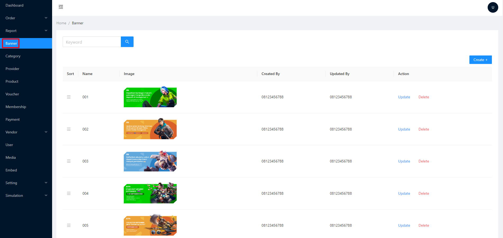
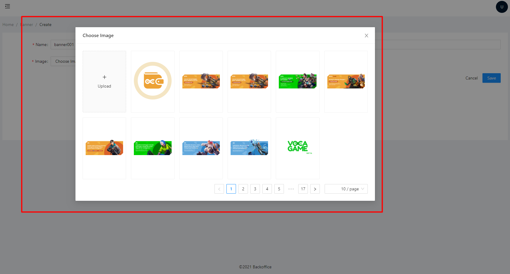

# Banner

Digunakan untuk menampilkan banner slider di landing page website

<figure><figcaption></figcaption></figure>

Langkah - langkah :&#x20;

1. Siapkan beberapa asset banner ukuran 448px X 150px
2. Buka admin panel
3.  Klik menu banner\

    <figure><figcaption></figcaption></figure>
4.  Create +\

    <figure><figcaption></figcaption></figure>
5.  Masukkan nama banner, upload gambar dan kemudian pilih banner yang ingin ditambahkan\

    <figure><figcaption></figcaption></figure>
6. Save -> DONE


NOTE : untuk mengatur urutan banner bisa drag & drop, klik dan tahan pada garis tiga\
.png>)

