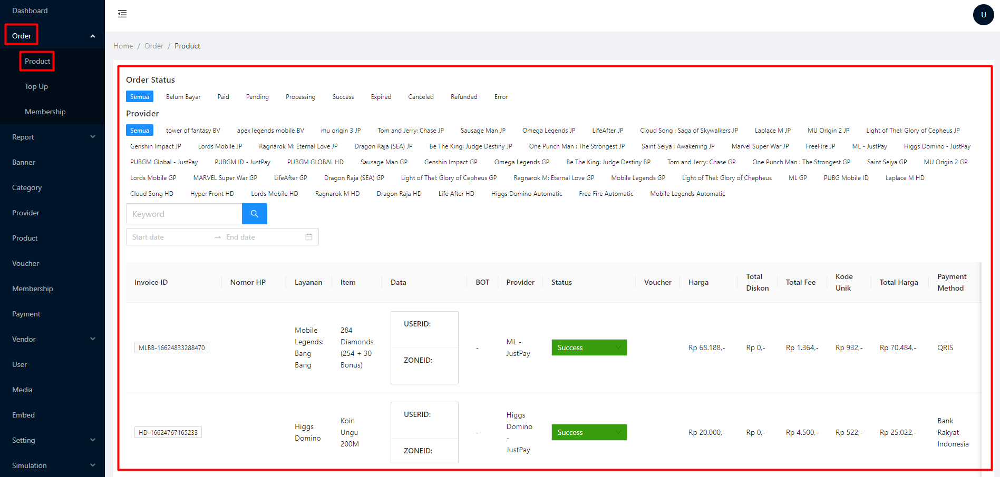

# Category

Digunakan untuk membuat kategori produk di website

<figure><figcaption>
Tampilan kategori di website
</figcaption></figure>

Langkah - langkah :&#x20;

<figure><figcaption></figcaption></figure>

Buka admin panel

1.  Klik menu Category\

    <figure><figcaption></figcaption></figure>
2. Create +
3.  Masukkan nama kategori\

    <figure><figcaption></figcaption></figure>
4. Save -> DONE


NOTE : untuk mengatur urutan Category bisa drag & drop, klik dan tahan pada garis tiga\
.png>)

