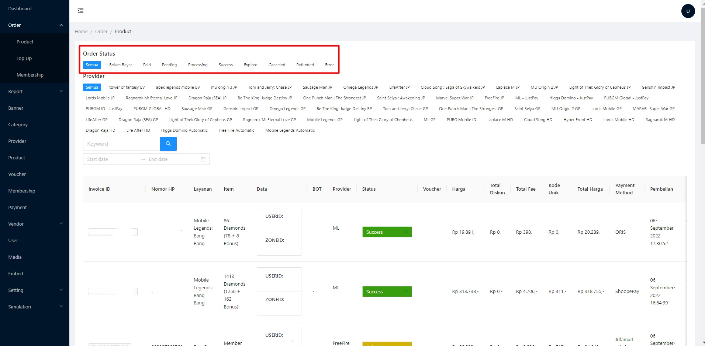

# 📦 Product

Berisi semua transaksi produk dan status transaksi.

status produk ada 9, yaitu :&#x20;

<figure><figcaption></figcaption></figure>

1. Belum bayar\
   Status belum bayar adalah pembeli belum melakukan transaksi pembayaran atau menunggu pembayaran.
2. Paid\
   Status paid adalah status pembayaran yang telah terkonfirmasi.
3. Pending\
   Status pending adalah antrean transaksi sebelum masuk ke processsing.
4. Processing\
   Status Processing adalah status proses pengiriman oleh sistem ke akun pembeli,\
   untuk status processing bisa berubah ke success atau error.
5. Success\
   Status success adalah status transaksi yang sudah berhasil.
6. Expired\
   Status expired adalah transaksi yang belum terbayar dan telah melewati batas waktu pembayaran yang telah di tentukan.
7. Canceled\
   Status canceled adalah transaksi menggunakan pembayaran E-wallet yang di batalkan oleh pembeli
8. Refunded\
   Status refunded adalah pengembalian dana kepada pembeli yang menggunakan fitur wallet/saldo ke akun pembeli
9. Error\
   Status error adalah transaksi mengalami kendala seperti,saldo habis, kendala dari vendor dan kendala dari pihak developer game
