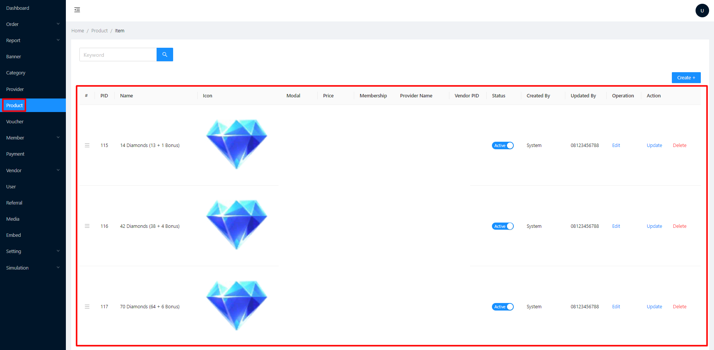

# Product

*   Berisi semua list produk, deskripsi produk, item / denom, dan harga produk\

    <figure><figcaption>
List Produk
</figcaption></figure>

    <figure><figcaption>
List item dan harga
</figcaption></figure>

<figure><figcaption>
Deskripsi produk
</figcaption></figure>


[buat-produk.md](buat-produk.md)



[add-item-and-price.md](add-item-and-price.md)

