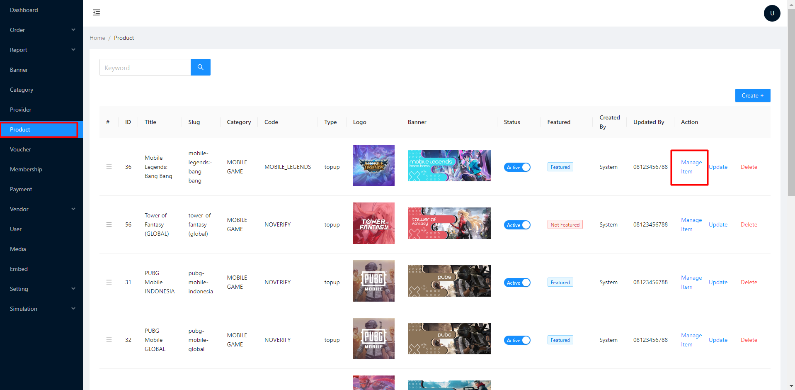
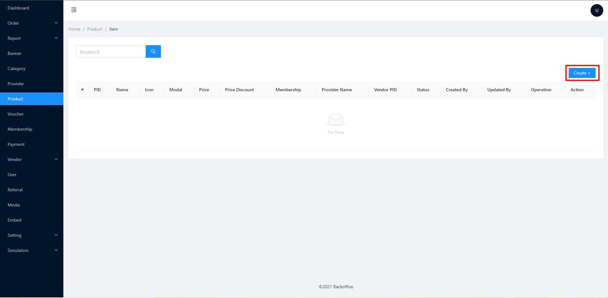
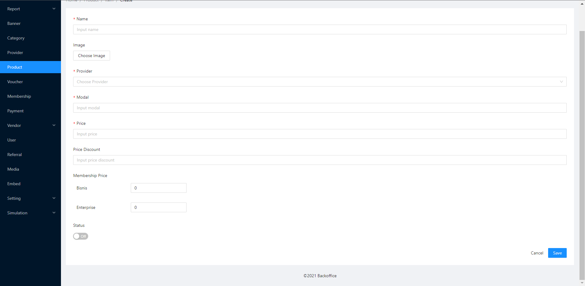

# 🧮 Add Item And Price

Langkah - langkah menambahkan item

1.  klik product,kemudian pilih manage item\

    <figure><figcaption></figcaption></figure>

2.  klik create+\

    <figure><figcaption></figcaption></figure>

3. isi Name
4. upload gambar item (opsional)
5. pilih provider
6. isi harga modal
7. isi harga publik
8. isi harga membership (opsional)
9. status on
10. Save -> Done\

    <figure><figcaption></figcaption></figure>
