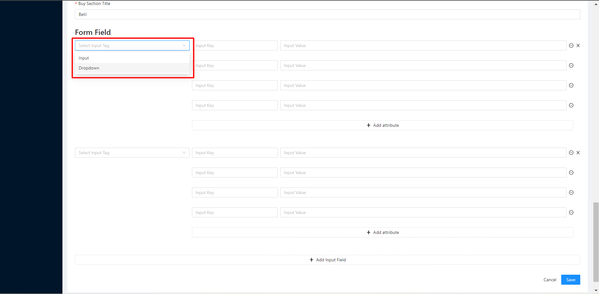
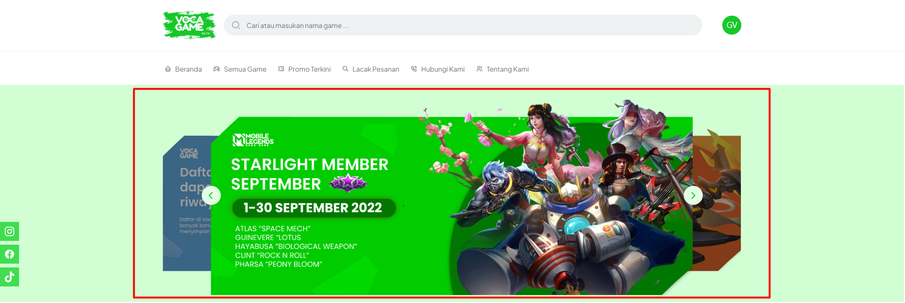
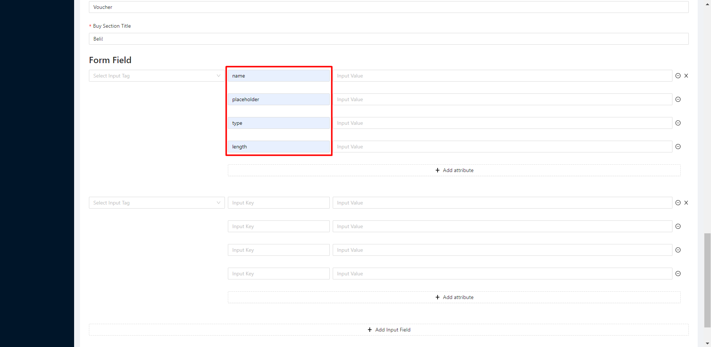

# 📚 Buat produk

Langkah - langkah buat produk

1.  Klik create+\

    <figure><figcaption></figcaption></figure>

2.  Isi detail produk\
    \- Title = Nama produk\
    \- Sub title = Bisa di isi game developer atau yang lainnya\
    \- Kategori = Kategori produk (mobile game, pc game, promo, dan lain - lain)\
    \- Tipe = Ada 2 pilihan (top up & voucher)\
    \- Code = Check nickname player

    <figure><figcaption></figcaption></figure>
3. Status ON
4.  Featured = untuk mengatur produk populer

    <figure><figcaption></figcaption></figure>
5. Upload logo produk
6. Upload banner produk
7. Upload helper (contoh : tempat id game berada)
8.  Tambahkan deskripsi\

    <figure><figcaption></figcaption></figure>

    \

9. Form Field\
   Add input form field (digunakan untuk input user ID)\
   \- Pilih select input tag\
   &#x20;  Input = pengguna dapat mengisi form\
   &#x20;  Dropdown = pengguna dapat memilih salah satu dari daftar pilihan menu yang ada

<figure><figcaption></figcaption></figure>

<figure><figcaption>
Input
</figcaption></figure>

<figure><figcaption>
Dropdown
</figcaption></figure>

&#x20; \- Isi form input key dengan format seperti gambar

<figure><figcaption></figcaption></figure>

\
\
\
\
\- Isi form input value untuk user ID\
&#x20;  name = userId\
&#x20;  placeholder = Masukkan User ID\
&#x20;  type = tel(angka)/text(text dan angka)\
&#x20;  lenght = panjang maksimal pengisian type

<figure><figcaption></figcaption></figure>

\
\
\
\
\- Isi form input value untuk zone ID\
&#x20;  name = zoneId\
&#x20;  placeholder = Masukkan Zone ID\
&#x20;  type = tel(angka)/text(text dan angka)\
&#x20;  lenght = panjang maksimal pengisian type

<figure><figcaption></figcaption></figure>

\
\
\
\
\- Isi form input value untuk pilih server (Dropdown)\
&#x20;  name = zoneId\
&#x20;  placeholder = Pilih Server\
&#x20;  Datas = Untuk script bisa langsung ke grup support masing-masing

<figure><figcaption></figcaption></figure>

10\. Save -> DONE


Untuk type voucher tidak perlu membuat form field

